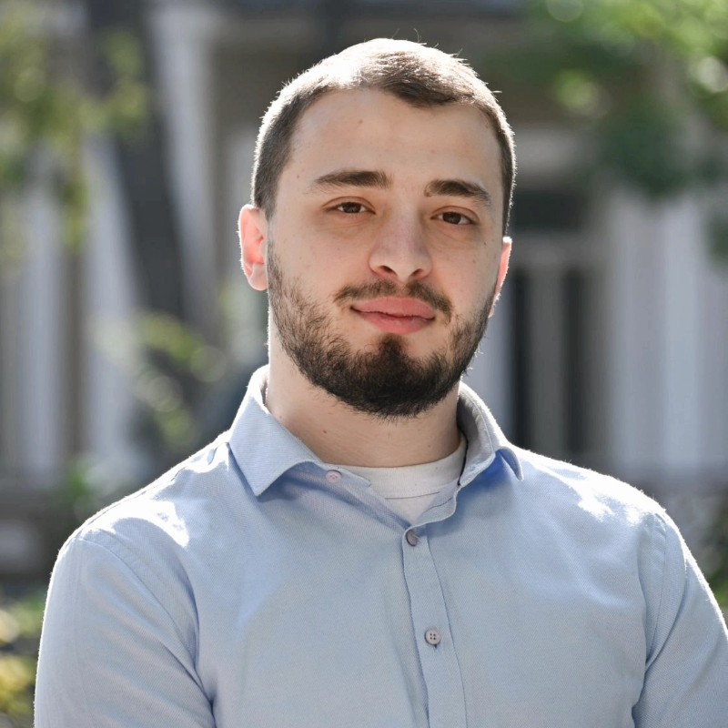

# Curiculum Vitae

## Personal Info
  
**Merab Kopaleishvili**
Full-stack Web Developer

**Address**  
Petre Kavtaradze Street no.58, Tbilisi

**Phone Number**  
+995 577 44 28 59

**E-mail**  
[merabkopaleishvili1993@gmail.com](mailto:merabkopaleishvili1993@gmail.com)

**LinkedIn**  
[linkedin.com/in/m-kopaleishvili](https://www.linkedin.com/in/m-kopaleishvili/)

## Certification

**PeopleCert for Angular:**  
Software development skills in Angular, Specialist Certificate  
_24 MAR 2025_

## Languages

**Georgian:** Native  
**English:** Fluent (IELTS 8.0)  
**Russian:** Adept

## Hosted Applications

**E-Commerce app:** [techno-eshop](https://techno-eshop-d7f6c2d02709.herokuapp.com/)  
E-Commerce App with general products. Each product can have any set
of attributes and to enforce uniformity admin role can use prototypes.
ASP.NET api, PostgreSQL database, Angular client, Angular Material for
web design  
[_repository_](https://github.com/mero93/technoEShop)

**Task-Tracking app:** [momentum-app](https://momentum-mero93.netlify.app/) _(Frontend only)_  
[_repository_](https://github.com/mero93/momentum-project)

## Trainings and Coding Experience
**GITA International Certification Program, New Horizons
Bulgaria Angular Frontend Programming:**  
Main subjects of Training: Javascript, Typescript, Angular
framework, designing app with RESTful API and Angular
client  
_OCT 2024 – FEB 2025_

**EPAM Full-Stack Web-Development Bootcamp:**  
Main subjects of Training: C#, object-oriented programming,
ASP.NET, different design patterns, designing MVC projects,
RESTful API, designing app with ASP.NET api and Angular
client  
_FEB 2022 – AUG 2023_

## General Education

**Magister’s Degree in Civil Engineering:**  
Agricultural University of Georgia, Tbilisi, Georgia  
_SEPT 2020 – JUL 2022_

**Bachelor’s Degree in Civil Engineering:**  
Agricultural University of Georgia, Tbilisi, Georgia  
_OCT 2012 – JUN 2017_

**Erasmus Mundus Education Program “Infinity”:**  
School of Architecture of University of Lisbon,
Lisbon, Portugal  
_SEPT 2014 – JUL 2015_

## Code Example

**Goal: decode Morse code**
>     const decodeMorse = function(morseCode){  
>         const separateCodeWords = morseCode.trim().split('   ');
> 
>         const wordDecoder = (code) => {  
>             const morseChars = code.split(' ');
>   
>             return morseChars.reduce((string, currentChar) => string + MORSE_CODE[currentChar], '' );  
>         }
> 
>         return separateCodeWords.map(word => wordDecoder(word)).join(' ');
>     }
